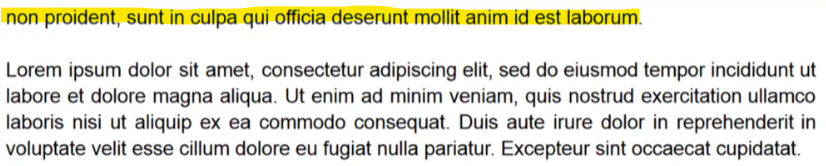
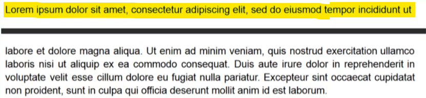
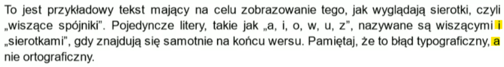
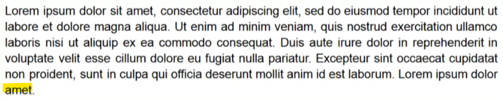
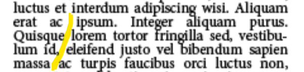

## Numeracja stron
Dokument do aplikacji należy wgrać wraz ze stroną tytułową oraz orzeczeniem. Jako pierwszą stronę uważa się stronę po stronie tytułowej. Numeracja powinna sie pojawić dopiero na stronie, na której znajduje się pierwszy rozdział, tj. STRESZCZENIE, ABSTRACT.

## Błędy typograficzne
#### Definicje:

* bękart - błąd typograficzny polegający na pozostawieniu pojedynczego wiersza końcowego akapitu, który znalazł się na początku nowego łamu.

* szewc - błąd typograficzny polegający na pozostawieniu pierwszego wiersza kolejnego akapitu na końcu poprzedniego łamu.

* sierota - błąd typograficzny polegający na pozostawieniu pojedynczego spójnika, który nie został przeniesiony do kolejnego wersu.

* wdowa - błąd typograficzny polegający na pozostawieniu na końcu akapitu bardzo krótkiego wiersza.

* korytarz - błąd typograficzny polegający na przypadkowym ułożeniu odstępów międzywyrazowych w sąsiadujących wierszach tekstu w taki sposób, że tworzą pionowe pasy bieli.

#### Systematyzacja błędów:

Nazwa błędu: nazwa (PL)

Kategoria: nazwa (ENG)

Komentarz: Wykryto (nazwa błędu) - skrócona definicja

## Obszar wykluczenia błędów
Z racji faktu, że praca dyplomowa zawiera wiele elementów tekstowych, niebędących tekstem ciągłym, poszczególne części dokumentu zostały wykluczone z analizy pod względem konkretnych błędów.
* Spis treści - wykluczono błędy justowania, sierot, bękartów, wdów oraz szewców.
* Spis obrazów - wykluczono błędy justowania, sierot, bękartów, wdów oraz szewców
* Spis tabel - wykluczono błędy justowania, sierot, bękartów, wdów oraz szewców
* Obszar obrazów - wykluczono błędy justowania, sierot, bękartów, wdów oraz szewców
